# Balancing State Exploration and Skill Diversity in Unsupervised Skill Discovery

## Code
This article is currently under revision, and the code will be organized and open-sourced after acceptance.

## Videos of the discovered unsupervised skills

ComSD (ours) can discover diverse robot behaviors at different exploratory levels, including different kinds of dynamic movements and static postures. **(balances state exploration and skill diversity)**

Rurrent advanced methods can either only learn different static postures **(low state exploration)** or only produce highly dynamic movements that are homogeneous **(low skill diversity)**.

We visualized some representative skills discovered by ComSD (ours) in Walker and Cheetah. We also visualize two representative baselines: CIC (low skill diversity) and APS (low state exploration), for comparison. You can refer to Section V-J in the paper for more detailed analysis.

___
### Walker

**ComSD (ours)**: Diverse behaviors at different exploratory levels. Hover over each video for description.

|  |  |  |  |  |  |
| :---: | :---: | :---: | :---: | :---: | :---: |
|  |  |  | 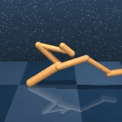 |  |  | 

**APS**: Different postures at low activity. (low state exploration)

|  | | |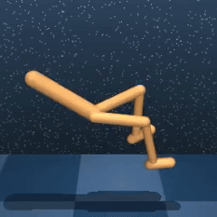  |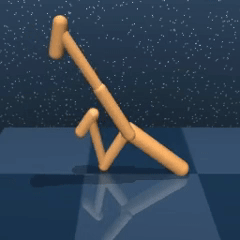 |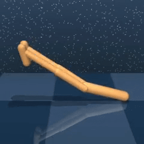 |
| :---: | :---: | :---: | :---: | :---: | :---: |

**CIC**: Homogeneous dynamically flipping. (low skill diversity)

|  | | |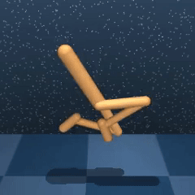  |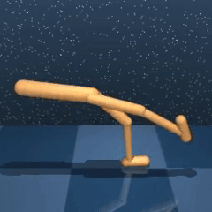 |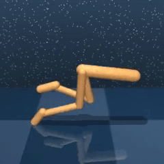 |
| :---: | :---: | :---: | :---: | :---: | :---: |

___
### Cheetah

**ComSD (ours)**: Diverse behaviors at different exploratory levels. Hover over each video for description.

|  |  |  |  |  |  |
| :---: | :---: | :---: | :---: | :---: | :---: |
|  |  |  |  |   |  |

**APS**: Different postures at low activity. (low state exploration)

|  | | |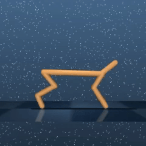  |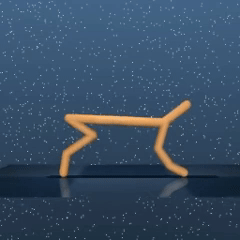 |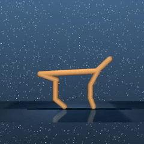 |
| :---: | :---: | :---: | :---: | :---: | :---: |

**CIC**: Homogeneous dynamically flipping. (low skill diversity)

|  | | |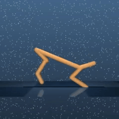  |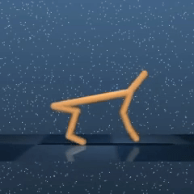 | |
| :---: | :---: | :---: | :---: | :---: | :---: |

___

The quantitative analysis also verify that our ComSD enables better balance between diversity and exploration than advanced baselines. You can refer to Section V-G&H in the paper for more detailed analysis.

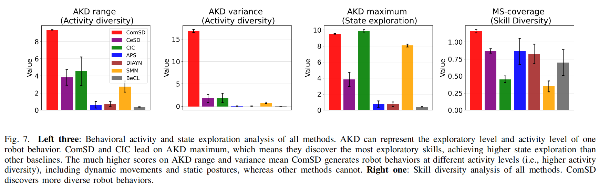

