# Contrastive-dynaMic-SD

ComSD

| | | | | | |
| :---: | :---: | :---: | :---: | :---: | :---: |
|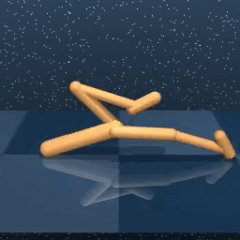 描述 1 | 描述 2 |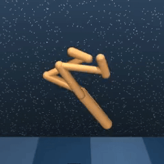 描述 3 |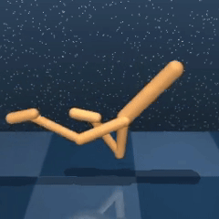 描述 4 | 描述 5 |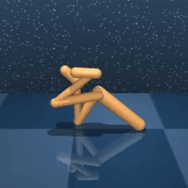 描述 6 |
| 描述 7 |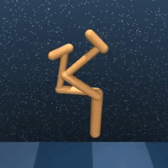 描述 8 |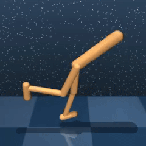 描述 9 |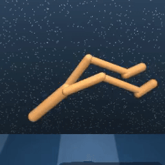 描述 10 |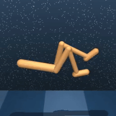 描述 11 |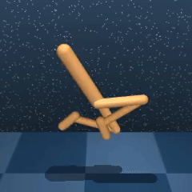 描述 12 |

| | | | | | |
| :---: | :---: | :---: | :---: | :---: | :---: |
| 描述 1 | 描述 2 |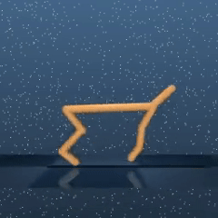 描述 3 |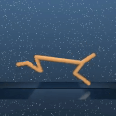 描述 4 |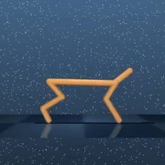 描述 5 | 描述 6 |
|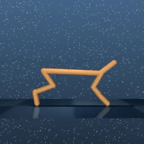 描述 7 |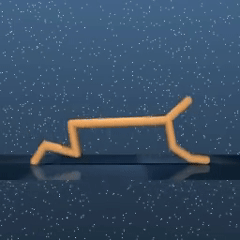 描述 8 |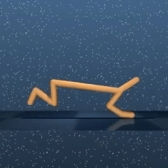 描述 9 |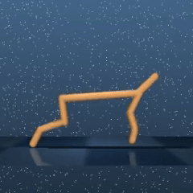 描述 10 | 描述 11 |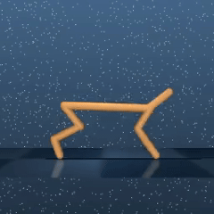 描述 12 |
