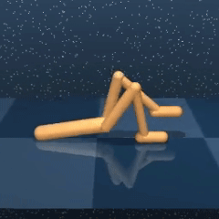
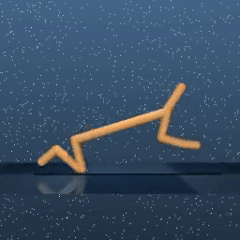

# Balancing State Exploration and Skill Diversity in Unsupervised Skill Discovery

## Code
This article is currently under revision, and the code will be organized and open-sourced after acceptance.

## Skill Visualization

### ComSD (ours)
(balance state exploration and skill diversity)

ComSD can discover diverse behaviors at different activity levels, including both dynamic movements and static postures.

|| | | | | |
| :---: | :---: | :---: | :---: | :---: | :---: |
|  Flip Forward |  flip backward |  failed flip |  advance on knees |  lie down & kick back |  Crawl Forward |
|  描述 7 |  描述 8 |  描述 9 |  描述 10 |  描述 11 |  描述 12 |

|| | | | | |
| :---: | :---: | :---: | :---: | :---: | :---: |
| 描述 1 | 描述 2 | 描述 3 | 描述 4 | 描述 5 | 描述 6 |
| 描述 7 | 描述 8 | 描述 9 | 描述 10 | 描述 11 | 描述 12 |

---
Recent advanced approaches cannot take both state exploration and skill diversity into account. They also can't generate behaviors at different activity levels.

### CIC (baseline)
(high state exploration, low skill diversity)

CIC is able to produce dynamic movements, but the generated skills are indistinguishable and homogeneous. It can't generate behaviors at other activity levels. 

|| | | | | |
| :---: | :---: | :---: | :---: | :---: | :---: |
| | |  |  | |  |

### APS (baseline)
(high skill diversity, low state exploration)

APS can generate non-homogeneous postures, but it suffers from lazy state exploration. It can't generate behaviors at other activity levels. 

|| | | | | |
| :---: | :---: | :---: | :---: | :---: | :---: |
|  | | |  | | |

