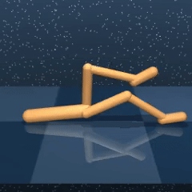
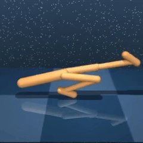
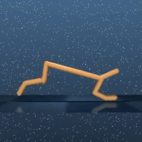

# Balancing State Exploration and Skill Diversity in Unsupervised Skill Discovery

## Code
This article is currently under revision, and the code will be organized and open-sourced after acceptance.

## Videos of the discovered unsupervised skills

**ComSD (ours)** can discover diverse robot behaviors at different exploratory levels, including different kinds of dynamic movements and static postures. **(balances state exploration and skill diversity)**

Rurrent advanced methods can either only learn different static postures **(low state exploration)** or only produce highly dynamic movements that are homogeneous **(low skill diversity)**.

We visualized some representative skills discovered by ComSD (ours) in Walker and Cheetah. We also visualize two representative baselines: CIC (low skill diversity) and APS (low state exploration), for comparison. 

### Walker

APS discover different static postures at low activity. CIC discover homogeneous dynamically flipping.  ComSD (ours) discover diverse behaviors at different exploratory levels. Move the mouse over eacn skill video to get its concrete description. 

#### ComSD (ours) 

|  |  |  |  |  |  |
| :---: | :---: | :---: | :---: | :---: | :---: |
|  |  |  |  |  |  |

### Cheetah

|  |  |  |  |  |  |
| :---: | :---: | :---: | :---: | :---: | :---: |
|  |  |  |  |  |  |

___
Recent advanced approaches cannot take both state exploration and skill diversity into account. They also can't generate behaviors at different activity levels.

### CIC

CIC is able to produce dynamic movements, but the generated skills are **indistinguishable and homogeneous**.  In addition, it can't generate behaviors at other activity levels (e.g., postures).  **(high state exploration, low skill diversity)**

#### Left three: Walker &nbsp;&nbsp;&nbsp;&nbsp;&nbsp; &nbsp;&nbsp;&nbsp;&nbsp;&nbsp;&nbsp;  Right three: Cheetah

 | | | | | | |
| :---: | :---: | :---: | :---: | :---: | :---: |
| | |  |  | |  |

Skills discovered by CIC are all trying to dynamically flip.

### APS

APS can generate non-homogeneous postures, but it suffers from **lazy state exploration**. It can't generate behaviors at other activity levels (e.g., dynamic flip). **(high skill diversity, low state exploration)**

#### Left three: Walker &nbsp;&nbsp;&nbsp;&nbsp;&nbsp; &nbsp;&nbsp;&nbsp;&nbsp;&nbsp;&nbsp;  Right three: Cheetah
|  | | |  | | |
| :---: | :---: | :---: | :---: | :---: | :---: |

|  | | |  | | |
| :---: | :---: | :---: | :---: | :---: | :---: |

Skills discovered by APS are all different static postures.

___

The quantitative analysis also verify that our ComSD enables better balance between diversity and exploration than advanced baselines.

